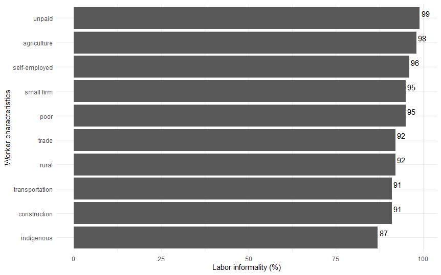
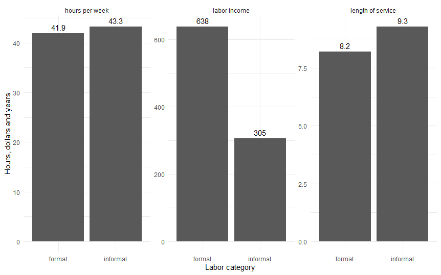

```{r setup, include=FALSE}
knitr::opts_chunk$set(echo = TRUE)
```

```{r datasets, include=FALSE}

#load datasets

mydata <- readRDS("C:/Users/nelson/projects/Proyecto final Harvard/my final project edx/My_project_edx/mydata.Rds")

test_set <- readRDS("C:/Users/nelson/projects/Proyecto final Harvard/my final project edx/My_project_edx/test_set.Rds")

train_set <- readRDS("C:/Users/nelson/projects/Proyecto final Harvard/my final project edx/My_project_edx/train_set.Rds")

```

```{r, echo=FALSE, include=FALSE}
library(caret)
library(rpart)
library(randomForest)
```

# Introduction

## Motivation and goals

Labor informality is a serious problem for several underdeveloped countries, one of them being Bolivia, where according to the latest data it would exceed 80% of total employment. Informality is considered negative for an economy because behind it are hidden elements such as the precariousness of work, low salaries, risks of accidents and labor exploitation, absence of health insurance or retirement, to mention just a few.

According to [@canavire2016informality], informality in labor markets is characteristic of both developed and developing economies and, therefore, generates significant social costs in all nations. Schneider (2004 and 2007), for example, showed that the informal sector represents between 8% and 23% of GDP in developed countries compared with 23% and 60% in developing nations. Other authors (Bourguignon, 1979; Galvis, 2012) have found that informal workers tend to generate a lower proportion of physical capital and earn lower average wages than formal workers. Furthermore, because the formal sector usually contracts the most qualified workers, it is characterized by an excess labor supply that it cannot employ. Therefore, the informal sector must employ these residual workers.

For these reasons, it is fundamental for the country's authorities and economic and social policy makers to understand what are the main factors behind people's decision to enter the labor market as informal workers. The academic literature on the subject indicates that characteristics such as education, labor and retirement legislation, minimum wage rules, and other intrinsic factors such as the customs or traditions of each population are the most important factors for explaining labor informality.

It is in this sense that my project focuses on developing models studied within the platform courses (edX) that can serve to classify between formal and informal workers using a series of demographic and labor variables for Bolivian workers. My interest goes a bit beyond simple classification, I also want to know what are the main variables that explain the results behind each of the models and thus be able to know with some certainty what are the factors that should be taken into account when designing economic or social policies that seek to reduce labor informality in my own country.

## A glimpse about labor informality

The International Labor Organization (ILO) --*main agency of United Nations for setting labour standards, developing policies and programmes promoting decent work for all women and men* --- states that the term "informal economy" refers to a certain way of carrying out economic activities. The informal economy comprises more than half of the global labour force and more than 90 per cent of micro and small enterprises worldwide. Informality is an important characteristic of labour markets in the world with millions of economic units operating and hundreds of millions of workers pursuing their livelihoods in conditions of informality.

The expression "informal economy" encompasses a huge diversity of situations and phenomena, as mentioned before. Indeed, the informal economy manifests itself in a variety of forms across and within economies. In this sense, formalization processes and measures aiming to facilitate transitions to formality need to be tailored to specific circumstances faced by different countries and categories of economic units or workers.

The main characteristics of work in the informal economy are often characterized by small or undefined work places, unsafe and unhealthy working conditions, low levels of skills and productivity, low or irregular incomes, long working hours and lack of access to information, markets, finance, training and technology. Whats more, most of the workers in the informal economy are not recognized, registered, regulated or protected under labour legislation and social protection.

Studies have identified that some of the main causes for informality include elements related to the economic context, the legal, regulatory and policy frameworks and to some micro level determinants such as low level of education, discrimination, poverty and lack of access to economic resources, to property, to financial and other business services and to markets. The high incidence of the informal economy is a major challenge for the rights of workers and decent working conditions and has a negative impact on enterprises, public revenues, government's scope of action, soundness of institutions and fair competition.

The promotion of decent work needs a comprehensive and integrated strategy and involves a range of institutional and society actors that eliminates the negative aspects of informality, while preserving the significant job creation and income generation potential of the informal economy. It should promote the protection and incorporation of workers and economic units in the informal economy into the mainstream economy using a good understanding of the main factors that cause it in each country.

## About the data: Household Survey for Bolivia 2018

For this project I will be using data from the Household Survey for Bolivia 2018, this information is freely accessible through the website of the National Institute of Statistics: (<https://www.ine.gob.bo/index.php/censos-y-banco-de-datos/censos/bases-de-datos-encuestas-sociales/>). The Household Survey is an instrument which aims to provide statistics and socio-economic and demographic indicators of the Bolivian population, necessary for the formulation, evaluation, monitoring of policies and design of action programs for the country development.

The 2018 Household Survey has the following specific objectives: 1. Produce a database with updated information on important variables that will generate statistics and sector indicators for monitoring the Sustainable Development Goals (SDG). 2. To measure the behavior of poverty indicators of the Bolivian population according to their determinants. 3. Identify the demographic and socioeconomic conditions of the population with work or employment activity, their household income, poverty, housing quality, health care and education.

The Household Survey 2018 presents a complete picture of the living conditions of the Bolivian population. The unit of analysis for this survey was Bolivian households and it is a cross-sectional survey. The thematic scope of the survey covers the following eight aspects:

a)  Characteristics of the Housing
b)  Socio-demographic characteristics
c)  Migration
d)  Characteristics in Health
e)  Educational Features. Access and Use of Information and Communication Technologies (ICT)
f)  Activity Condition and Occupational Characteristics
g)  Non-labor household income
h)  Household expenses

For the purpose of this project, I will use measurement of employment and other labor market related variables, poverty indicators, years of schooling, and other demographic indicators for the construction of the models that will allow us to forecast labor informality.

## Document structure

The rest of the document is structured in the following way, an Analysis section where in a first part I explain the process of data cleaning, imputation of missing observations and partition of the base into a training and a testing base, then I explain the development of three different models of machine learning to make forecasts of labor informality. In the Results section I present the main findings of my three models explaining the most important characteristics of each one. Finally, I conclude my project by summarizing my most relevant findings, explaining some of the limitations of my work and the future ideas to be developed.

# Analysis

Figure 1 shows some of the demographic and labor characteristics of Bolivian workers that would be accompanied by high levels of labor informality. For example, we observe very high levels of informality[^1] among workers who do not receive remuneration, those who work in agricultural activities in rural areas, or those self-employed workers who work in small companies (with less than 5 workers), workers in commerce, construction or transportation are also accompanied by high levels of informality as well as those who identify themselves as indigenous.

[^1]: A worker is considered to be informal if he or she does not make social security contributions or is not affiliated with a Pension Fund Administrator, in other words, informality is approached through workers who do not contribute for their retirement.



In Figure 2 we can see other characteristics of numerical variables (hours worked per week, monthly labor income and length of time in the job), in which we see that informal workers tend to work on average almost 1.5 hours more per week than formal workers, earning approximately 305 dollars per month, or only 48% of what a formal employee earns, and finally, we see that informal workers have stayed on average 1 year longer in their current job when compared to formal workers, which may show less labor dynamism in this sector.



## Data wrangling & descriptive analysis

For this project I take 15 demographic and labor market variables from the Bolivian Household Survey for 2018. These 15 variables have been selected taking into account that they can be good predictors of labor informality observed in the country. Among the selected demographic variables are: 1. the zone (urban or rural), 2. gender (male or female), 3. age, 4. race (whether the interviewee is considered indigenous or not), 5. number of household members, 6. interviewee's years of education and 7. If the interviewee is considered poor according to the household income criteria.

In the case of the labour market variables included in our study we have the following: 8. economically active population (persons 15 years of age or older), 9. labor category (distinguishing between employees, employers, self-employed and unpaid), 10. branch of labor activity (with 9 categories: agriculture, mining, manufacturing, basic services, construction, trade, transportation, financial institutions and social services), 11. size of the company (small, medium and large), 12. labor formality (our dependent variables that take the value 0 for informal and 1 for formal), 13. working hours per week, 14. monthly labor income (measured in local currency), and 15. length of time in the job (measured in years).

We can see here the summary of our raw data base:

```{r structure of the raw data, echo=FALSE}
summary(mydata)
```

The initial raw data base presents data for 37,517 people; however, in a first stage we will filter the data to keep only those people who are considered economically active, that is, those who are 15 years old or older, remaining after this operation with just 17,659 observations.

In a next stage we look for extreme values (outliers) in the variables so that once identified we can isolate them in order to avoid disturbance of these few observations in the models we are going to develop. To perform this process, we use Tukey's rule presented in the course, which states that the extreme values will be those that exceed the values located at the 75th percentile of the distribution plus 1.5 the interquartile range (IQR), see [@irizarry2019introduction] for more details.

**Outliers.** We identified extreme values in four of the numerical variables in our database (age, hours of work, labor income and job tenure), on the other hand, we did not find evidence of outliers in the variable years of education. The total of extreme values found is 2,878, these observations were filtered from the database to avoid potential biases in the subsequent projections.

**Missing values.** Once the outliers were eliminated, we concentrated on working with the missing values, identifying the absence of 562 data in 3 variables of our base: size of the companies, years of education and poverty. For this project I decided to impute the missing values using the *BagImpute* function of the Caret package[^2] instead of eliminating the observations with missing data, this for two reasons, the first to practice with the use of this important data imputation tool and the second, to not continue losing data, since with the cleaning of outliers I lost almost 3,000 observations.

[^2]: This method of recovering missing values uses bagging of regression trees. It provides the recovery of missing values for several variables at once, based on regression dependencies. For more information you can consult the Help repository for Pre-Processing of Predictor on the Caret package.

The first step for the imputation of the missing values was to convert the character variables into factors, and then to be able to convert all the variables into dummies, this because the *BagImpute* function only allows to make imputations for numerical variables. Once the imputation was done, the only thing left to do was to work a little with the new predicted variables (education, firm size and poverty) to return them to the original values of the initial base and thus begin with the construction of the forecast models for labor informality.

**Data partition.** Once the new imputed variables (new education, new poverty and new firm size) were added to the data, I proceeded with the partitioning of the database into the training and testing sub-samples following the criteria of maintaining the balance of the variable of interest (in this case labor informality), that is, we know that the original base presents a proportion of about 80% of informal workers and 20% of formal workers, for this reason, it is of utmost importance to maintain these proportions in the sub-samples that we will create and use for both the training and the validation of our models.

My database, after the cleaning of extreme values and the imputation of missing values has been left with 17,734 observations. We can see that in this final base, 3,046 people are formal workers and the remaining 11,688 are informals, that is, the informality rate is 79.3%.

Using this rate as a reference, I proceed to create a partition of this database into a training set and a test set. My new training base is composed of 11,786 observations and the testing base of 2,948, as you can see below, both sub-samples maintain the proportion of approximately 80% informal and 20% formal workers:

```{r ratios new test and train sets}
prop.table(table(train_set$formality))

prop.table(table(test_set$formality))
```

With databases properly sorted, cleaned and partitioned, we are ready to begin our model analysis to forecast labor informality in Bolivia.

## Data modeling approaches

Since the variable of interest for our models is labor informality, a dichotomous variable (0, 1), it is appropriate to choose methodologies suitable for this type of data. In this sense, one of the best known methodologies in conventional econometrics for dealing with dichotomous dependent variables is that of logistic regression, with which I will begin my analysis. Later, I will advance with new methodologies learned in the different modules of the course, taking advantage of the greater computational power of methodologies such as classification trees, and I will finish with the random forest approach.

For each model, I will use as the dependent variable the "labor formality" and as explanatory variables the rest of 13 demographic and labor market variables mentioned previously: 1. zone, 2. gender, 3. age, 4. race, 5. \# family members, 6. labor category, 7. labor branch, 8. working hours, 9. labor income, 10. job tenure, 11. firm size, 12. years of education and 13. poverty.

### Logistic regression

My first method is logistic regression or logit which is one of the traditional econometric techniques for modeling binary variables and seems a good starting point for analyzing the factors that explain labor informality in Bolivia. The logit specification traditionally follows this structure:

$$
Pr(Y=1 \mid X=x)
$$

In this case, we define the outcome variable $Y$ as 1 for formal workers and 0 otherwise, and $X$ as a matrix of our reminding 13 explanatory variables. This methodology must be slightly adjusted at the time of making the forecasts, since they are not produced in a dichotomous way (0 or 1) but as continuous values that are between these limits, so they must be a little bit adjusted so that forecasts greater than 0.5 are equal to 1 and those less than or equal to 0.5 are defined as 0s.

The R code used for estimating this first approach is:

```{r Logistic Regression, echo=T, results='hide'}
glm_model <-  glm(formality ~ ., data= train_set, family = "binomial")
```

We will see the accuracy and the main coefficients of the variables (size and significance) in more detail in the Results section.

### Classification or decision trees

I use this methodology to take advantage of the visual benefits it offers for the interpretation of results, specifically I talk about the option of graphing the decision trees that allow us to see which are the main variables and decision thresholds to classify the observations. Nevertheless, as mentioned by [@irizarry2019introduction] this methodology also has some negative aspects such as the ease of over-training, reduced precision and low stability in relation to changes in the training data.

For the application of this methodology I establish some additional control measures such as cross validation (10 fold), and a grid of values ranging from 0 to 0.1 in a range of 25 values for tuning the complexity parameter. The code for this model is as follows:

```{r Decision tree, results='hide'}
train_rpart <- train(formality ~ .,
                     method = "rpart",
                     tuneGrid = data.frame(cp = seq(0.0, 0.1, len = 25)),
                     trControl = trainControl("cv", number = 10),
                     data = train_set)
```

Once the first classification tree model is calculated, I identify the optimal complexity parameter through the *\$bestTune* option and use it in a new model. The results of this model are presented and explained in detail in the following section.

### Random forest

The last model developed for this exercise is the random forest, with this methodology I seek to improve a little the precision of the predictions through the intensive calculation of many trees and the subsequent results averaging, with it we try to overcome the instability of the classification tree methodology, however we sacrifice in some way the interpretability of the models because we can no longer build a decision tree because we now have a forest instead of a single tree. However, the methodology offers an alternative for interpretation that will help us for understanding the variables that would explain labor informality, this valuable information is known as *Variable Importance*.

For the construction of the random forest model I also use cross-validation (10 fold) and a grid for the calibration of the number of variables to be included in the partition of each tree node (*mtry* parameter), I defined the number of trees in 150 and the sample for each iteration in 2000 observations. The code for this best model (already tuned with the best parameters) is as follows:

```{r Random Forest, echo=T, results='hide'}
rfcontrol <- trainControl(method="cv", number = 10)

rf_best <- randomForest(formality ~ .,
                        data = train_set,
                        trControl = rfcontrol,
                        ntree = 100,
                        minNode = rf$mtry)
```

In this case, after running the first model we observe that the error in the model does not improve after 100 trees in each model (see Figure 3), therefore this would be the optimal number to include, additionally the initial model gives us as result that the optimal number of variables to include in each model is 3 (*mtry*).


# Results

The logistic regression model reports an accuracy of 0.9135, with a sensitivity of 0.9564 and a specificity of 0.7492, the balanced accuracy (a more appropriate measure than the overall accuracy) of this model is 0.8528. In general, this first approximation offers a fairly good accuracy, and the results of the regression *per se* are also very interesting to interpret:

```{r Logistic regression model, include=FALSE}
glm_model <-  glm(formality ~ ., data= train_set, family = "binomial") #model
```

```{r logistic results}
summary(glm_model)
```

We observe that variables such as the small and medium size of firms or being a self-employed worker are strong factors that would affect the fact of being an informal worker, we appreciate this in the negative sign of the coefficients, their size and their statistical significance. On the other hand, the factors that would explain formal work would be constituted by being a worker in the financial sector, mining or basic and social services.

The results of the second model, classification tree, also show relevant findings. First, we obtain an overall accuracy of 0.9115 with this methodology, a sensitivity of 0.9645 and a specificity of 0.7082, with a balanced accuracy of 0.8363.

In addition, this methodology offers a very valuable graphic element to perform the interpretation of the results, the decision tree (Figure 4):


In this tree we can see that the first variable to make the classification between formal and informal workers is the small size of the company, in a next level we see that the labor income variable plays an important role, as well as the years of education of the people, or working in sectors like construction and the years of seniority in the job. This graph is of great help to better understand the results of the model and the main elements that would be behind the classification.

Finally, we have the results of the random forest, using this methodology we obtain an overall accuracy of 0.9189, a sensitivity of 0.9658 and a specificity of 0.7393, with a balanced accuracy of 0.8526, being this by little the best of the three models in terms of forecasting accuracy.

As mentioned previously, the main disadvantage of this technique is that it loses the interpretability of the results by having forests instead of trees and not being able, for example, to make the graphical representation of the results as we did with the decision trees. However, the random forest methodology offers us an attractive alternative, that of being able to identify the main variables behind the model:


According to these results (Figure 5), we observe that the 4 main variables that would be explaining the classification between informal and formal workers using random forest are: firstly, the size of the company where the workers are employed, secondly, the labor income, then the years of education of each worker and finally, the branch of activity where the workers work. These results are in line with those found in the two previous models.

# Conclusion

This project focused on building models to classify workers into formal and informal labor categories using data from the Bolivian Household Survey for 2018. Three different approaches were constructed using logistic regression, classification tree and random forest, obtaining the following results:

+-------------------------+-------------------------------+---------------------------+-----------------------------------------------------+
| Model                   | Overall and balanced accuracy | Sensitivity & specificity | Main variables                                      |
+=========================+===============================+===========================+=====================================================+
| 1.  Logistic regression | 0.9135 / 0.8528               | 0.9564 / 0.7492           | firm size, labor category and labor branch          |
+-------------------------+-------------------------------+---------------------------+-----------------------------------------------------+
| 2.  Classification tree | 0.9115 / 0.8363               | 0.9645 / 0.7082           | firm size, labor income, education and labor branch |
+-------------------------+-------------------------------+---------------------------+-----------------------------------------------------+
| 3.  Random forest       | 0.9210 / 0.8551               | 0.9675 / 0.7426           | firm size, labor income, education and labor branch |
+-------------------------+-------------------------------+---------------------------+-----------------------------------------------------+

: Summary of the main findings on each model

It should be noted that the results in terms of precision in the three models are very similar, with the approach using random forest prevailing for very little. Similarly, all three models show that the main variables that would explain informal labor would be related to the size of the firm who employs the workers, with small companies tending to employ more informal workers, and sectors such as construction and transportation also being more associated with informal employment, other elements that would explain this category of employment would be labor income and years of education, where in both cases, lower values would imply greater likelihood of being classified as an informal worker.

**Limitations.** A limitation that is evident in the results of the three models is the low specificity reported, in all cases below 0.8, i.e., we have more difficulty predicting formal workers than informal ones. This can be explained by the lower number of formal workers in the database. As mentioned at the beginning of the document, labor informality in Bolivia is over 80%, so having only 20% formal workers makes it more difficult to correctly classify them. I would like to be able to find out a little more about other algorithms that can deal with this type of problem.

**Next steps.** [@morales2015impact] point out that "for many authors informality is non-voluntary because it is associated with the impossibility of accessing to formal work due to their scarcity and mostly because many workers do not have enough skills to work in the formal sector. However, house survey-based studies showed that many workers are in the informal sector by their own decision and are satisfied of their situation". In this sense, and as a next step I would like to distinguish informal workers between those who have voluntarily chosen to be part of this sector and those who are informal out of necessity, in order to make this distinction it will be key to separate each sector using the labor income, expecting that the voluntary informals earn much more money than the informals out of necessity, another group of variables that could also help to make this distinction could be: the characteristics of the housing, the assets people possess or the degree of education of the workers. In this way, more appropriate policies could be designed to advance in the labor formalization of these people; it is very likely that the measures required to formalize some of them are not necessarily the same as those leading to the formalization of the others.

I would like to take this opportunity to thank the course colleagues who will be reviewing this work. Likewise, I would like to thank the team of the Harvard Data Science Course for all their work this year and for the many months of dedication to the program that have allowed me to grow in knowledge and skills. It has been a very productive journey, thank you very much!

# References
